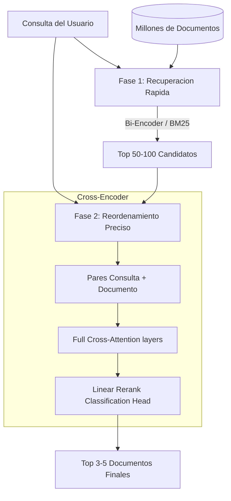

# cross-encoder-reranker

Modulo reordenador (Reranker) de alta precision basado en la arquitectura Cross-Encoder de redes neuronales Transformer.

Este componente actua como la segunda etapa (Stage-2) en sistemas de busqueda semantica y pipelines de Generacion Aumentada por Recuperacion (RAG). Recibe una lista preliminar de documentos candidatos recuperados de manera veloz por metodos de primera etapa (como busqueda vectorial o BM25) y calcula una puntuacion exhaustiva de atencion cruzada para ordenar los elementos, reduciendo el ruido e inyectando solo el contexto de mayor relevancia real en la ventana de contexto del LLM.

## Arquitectura y Fundamentos Teoricos

El diseno de recuperacion en dos fases resuelve el compromiso entre costo computacional y precision semantica.



### 1. Comparativa: Bi-Encoder vs Cross-Encoder

La diferencia radica en como interactuan la consulta y el documento dentro del modelo Transformer:

*   **Bi-Encoder (Fase 1 - Recuperacion):** Codifica por separado la consulta $Q$ y el documento $D$:
    $$\mathbf{u} = \text{Transformer}(Q), \quad \mathbf{v} = \text{Transformer}(D)$$
    La similitud se estima mediante una operacion simple en sus vectores resultantes:
    $$\text{sim}(Q, D) = \cos(\mathbf{u}, \mathbf{v}) = \frac{\mathbf{u} \cdot \mathbf{v}}{\|\mathbf{u}\| \|\mathbf{v}\|}$$
    *Complejidad:* $O(L_Q + L_D)$ en inferencia. Al no existir interaccion entre los terminos de $Q$ y $D$ durante las capas de autoatencion, se pierden relaciones de sintaxis y precision contextual fina.
*   **Cross-Encoder (Fase 2 - Reordenamiento):** Alimenta al Transformer con la secuencia conjunta de ambos textos:
    $$\mathbf{x} = [CLS] + Q + [SEP] + D + [SEP]$$
    *Complejidad:* $O((L_Q + L_D)^2)$ debido al calculo de la matriz de atencion sobre la secuencia unificada. Cada token de la consulta tiene la capacidad de interactuar directamente con cada token del documento en todas las capas del modelo, permitiendo identificar negaciones, sinonimos condicionales y correlaciones tematicas profundas.

### 2. Clasificacion de Secuencias Emparejadas

El token de clasificacion $[CLS]$ acumula la representacion agregada de toda la secuencia cruzada. La salida final es proyectada por una capa lineal para obtener un logit escalar de relevancia:

$$s(Q, D) = W \cdot \mathbf{h}_{[CLS]} + b$$

Donde $\mathbf{h}_{[CLS]}$ es el vector de estado oculto del token $[CLS]$ en la ultima capa del Transformer, $W$ es la matriz de pesos de proyeccion de la cabeza de secuencia y $b$ es el sesgo. Puesto que se trata de una tarea de regresion (tipicamente entrenada bajo conjuntos de datos como MS MARCO), las puntuaciones obtenidas no estan acotadas entre $0$ y $1$, representando la afinidad logaritmica de la consulta.

### 3. Logica de Fallback Offline (Algoritmo de Solapamiento Lexico)

Para garantizar la resiliencia en entornos locales con restricciones de recursos, el modulo incorpora un motor heuristico de similitud lexica normalizada que se activa si las dependencias de Deep Learning (`torch`, `transformers`) no estan presentes o falla la carga del modelo pre-entrenado:

$$\text{Score}_{\text{offline}}(Q, D) = 5.0 \cdot \left( \frac{|Q_{\text{tokens}} \cap D_{\text{tokens}}|}{|Q_{\text{tokens}}|} \right) + \frac{|Q_{\text{tokens}} \cap D_{\text{tokens}}|}{|D_{\text{tokens}}|}$$

Donde:
*   El primer termino calcula la proporcion de terminos de la consulta presentes en el documento, escalado por un factor multiplicador de `5.0`.
*   El segundo termino actua como un bono de densidad, priorizando aquellos documentos mas concisos que condensan la respuesta, disminuyendo el peso si el documento contiene un exceso de palabras irrelevantes.

## Conexion con el Ecosistema

Este modulo optimiza las respuestas de otros componentes del ecosistema:
1.  **hybrid-search-retrieval-pipeline:** Recibe la lista preliminar de candidatos devueltos por RRF o Score Normalization (por ejemplo, 30 candidatos). El Reranker aplica el analisis Cross-Encoder y reduce este conjunto a los 3-5 documentos con mayor relevancia empirica.
2.  **Orquestador General RAG:** Actua como filtro de paso intermedio antes de alimentar el prompt de sintesis del LLM, reduciendo costes de procesamiento (tokens de entrada) y mitigando el fenomeno de "perdida en el medio" (*lost in the middle*), donde los modelos de lenguaje tienden a ignorar informacion ubicada en la franja central de prompts excesivamente extensos.

## Estructura del Proyecto

*   `reranker.py`: Contiene la clase `CrossEncoderReranker`, que implementa la logica de seleccion de hardware, tokenizacion bidireccional, inferencia a traves de PyTorch y el fallback de solapamiento lexico offline.
*   `test_reranker.py`: Suite de pruebas automatizadas que verifican el correcto funcionamiento de las funciones de puntuacion offline y la integracion del pipeline de inferencia utilizando simulación de tensores.
*   `example.py`: Demostracion ejecutable que procesa una consulta sobre varios candidatos conceptualmente dispares, imprimiendo el cambio de orden en los rankings provocado por el reordenamiento.

## Instalacion y Requisitos

### 1. Activar el Entorno Virtual e Instalar Dependencias

Asegurese de instalar las dependencias requeridas para soportar la ejecucion de modelos de Hugging Face:

```bash
python3 -m venv .venv
source .venv/bin/activate
pip install -r requirements.txt
```

### 2. Ejecutar Pruebas Unitarias

Para comprobar los algoritmos de calculo local de scores y el control de dispositivos de hardware:

```bash
.venv/bin/python -m unittest test_reranker.py
```

### 3. Ejecutar Codigo de Demostracion

Para verificar la inferencia del Cross-Encoder (`ms-marco-MiniLM-L-6-v2`) sobre la CPU o aceleradores locales (MPS/CUDA):

```bash
.venv/bin/python example.py
```
